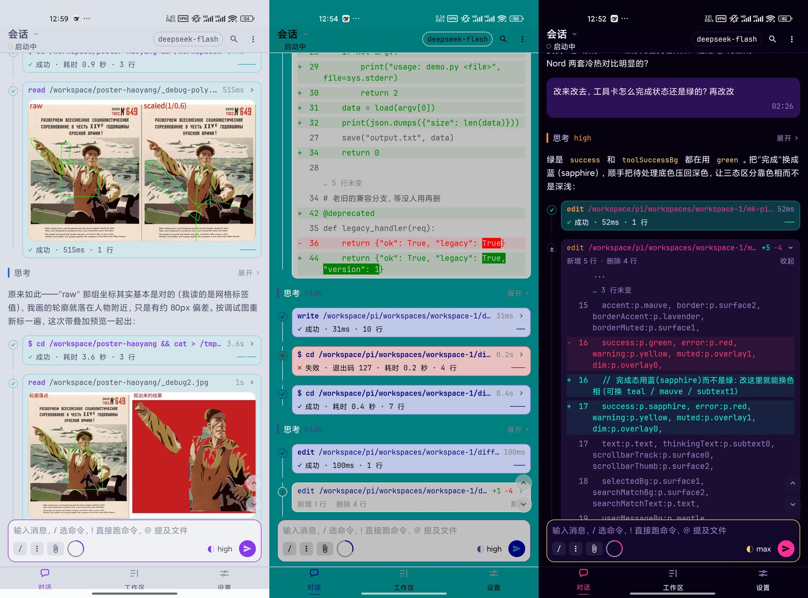
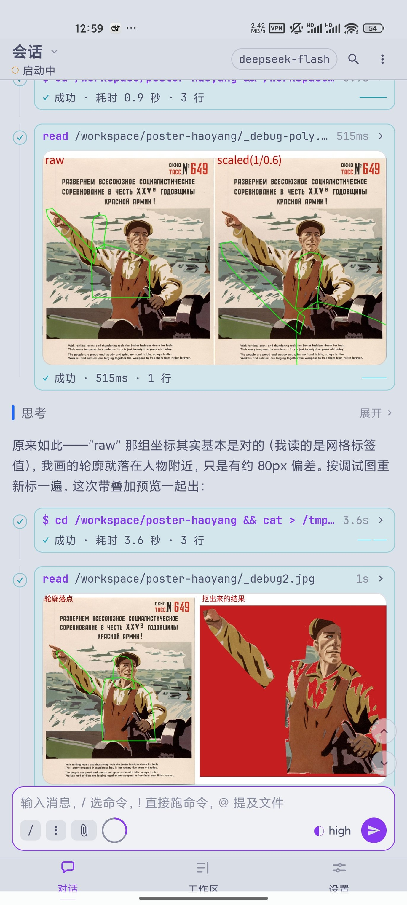
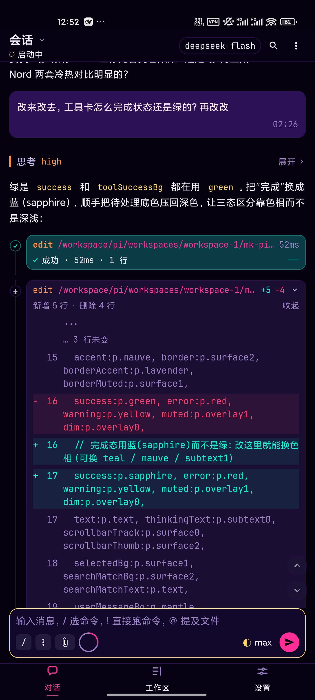
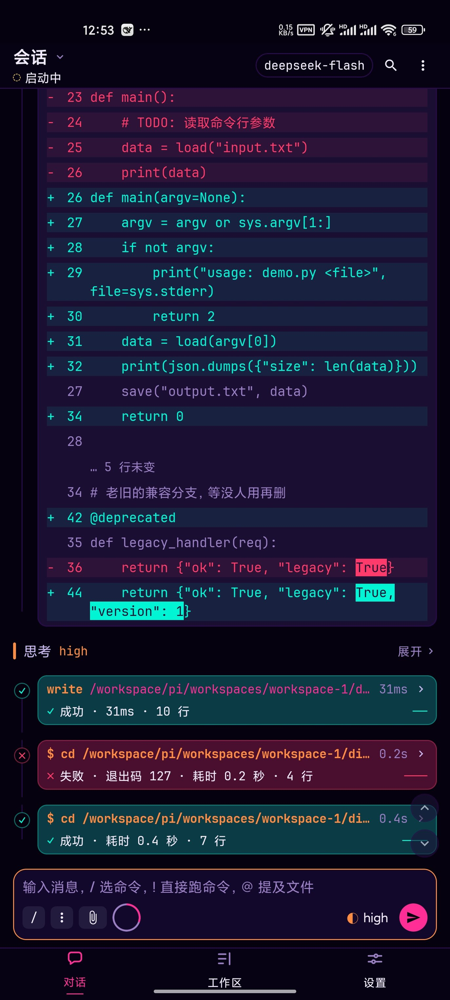
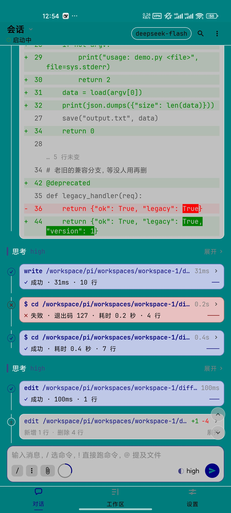
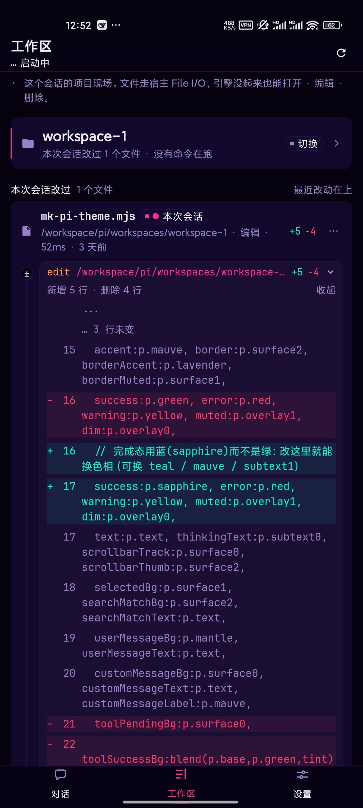
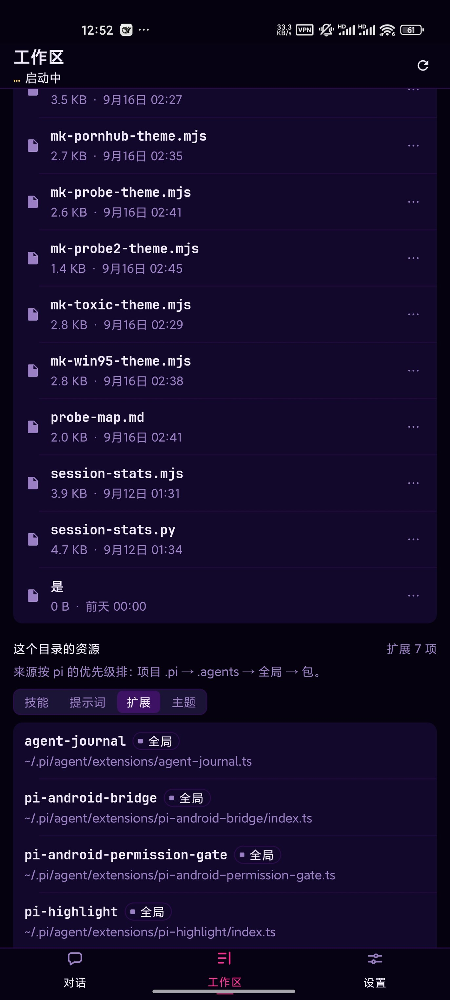

<p align="center">
  
</p>

<h1 align="center">PI</h1>

<p align="center">
  <strong>完整的 pi，完整地装进你的手机。</strong>
</p>

<p align="center">
  官方 pi 完整包 · 一个字节没改 · 真 Linux 跑在本机 · 能真的碰这台手机
</p>

<p align="center">
  <b>简体中文</b>
</p>

<p align="center">
  <a href="#完整的-pi一个字节没改">完整的 pi</a> ·
  <a href="#跟得上上游">跟得上上游</a> ·
  <a href="#哲学缺什么就自己写">哲学</a> ·
  <a href="#功能一览">功能一览</a> ·
  <a href="#架构">架构</a> ·
  <a href="#手机这一侧">手机这一侧</a> ·
  <a href="#装机">装机</a>
</p>

<p align="center">
  <a href="./docs/screenshots/banner-three-themes.jpg"></a>
</p>

---

## 完整的 pi，一个字节没改

> **包里装的是官方 pi 的完整 npm 包。**
> 不是子集，不是"支持了哪些功能"，不是照着重写的参考实现。

`@earendil-works/pi-coding-agent` **0.87.1**，从 npm 原样取回，连同它的整棵运行时依赖树——
**6 个 `@earendil-works/*` 运行时包、19 个直接依赖、npm 实装 118 个包**，全部随 APK 分发。

于是这里没有"实现了多少"的问题：

| | 自己写一个循环的 App | **PI** |
| :--- | :--- | :--- |
| Agent 循环 | 自己写一个 | **pi 的**：多轮推理、工具调用、失败重试、上下文压缩 |
| 内建工具 | 自己实现几个 | **pi 的全部**（手机上能跑的 7 个，`powershell` 只属于 Windows） |
| 会话文件 | 自定义格式 | **pi 的格式**：续接、压缩、分支摘要，跳到任意历史点继续 |
| 扩展系统 | 自己做一套 | **pi 的那一套**，给 pi 写的扩展拿来就用 |
| 技能 / 提示词 / 主题 | 内置常量表 | **pi 的文件约定**，`SKILL.md` 放进去就生效 |
| 模型与凭证 | 自己存一份 | **直接写 `models.json` / `auth.json` / `settings.json`** |
| 换一台设备 | 重新配 | **复制 `~/.pi` 就接着用** |

**不是"PI 有什么功能"，是"上游那份代码跑起来了"。**

---

## 跟得上上游

上游 pi 平均**不到五天**发一个新版本。这是很多"自己写一遍"的项目追不上的地方，
也是 PI 和它们最本质的差别：

> **上游更新，这里改一个版本号。**

版本号只写在**一处**（`tools/fetch-runtime.mjs` 的 `PI_VERSION`），构建时按它取包、
按 SHA-256 校验、打进载荷。上游加了新工具、新 provider、新的会话行为——
**升版本号，装进去就有**，不需要有人去"移植"。

配套三道保险，让这件事不会悄悄出事：

- **构建期契约检查**（`tools/pi-contract.mjs`，CI 的一个独立 job）：把 pi 的 RPC 命令、
  扩展界面方法、provider 预设、主题令牌值、`models.json` 语义、**工具结果文本**、
  **会话文件面**（条目类型 / 格式版本 / 可空的 `firstKeptEntryId`）逐条对着**钉住的那个
  引擎版本**核对；上游改名、删东西或改语义，**构建直接失败**，不会带着错发出去。
  每一条失败都会打印"该回去重读哪个 App 文件"。
- **协议全覆盖**：pi 在 RPC 模式下能发的 **33 条命令全部接入**，
  会发的 **9 种扩展界面方法每一种都有落点**。
- **全部载荷按 SHA-256 锁定**：Linux 运行时包、ripgrep/fd/git 与 proroot 的五个二进制记在
  [`runtime.lock.json`](runtime.lock.json)；pi 引擎走 npm 自身的完整性校验，外加构建期算出的
  `runtime-payloads/*.digest`——设备**逐个载荷**比对，只重解包真的变了的那个。

**你拿到的不是一份快照，是一条能一直走下去的路。**

---

## 哲学：缺什么就自己写

pi 最不一样的地方，是它把 agent 拆成了**文件**。

一个扩展是一个 `.ts`；一个技能是一个 `SKILL.md`；一套主题是一张 JSON 令牌表；
一段提示词是一个 markdown。它们都是普通文件，放在普通目录里，**pi 启动时读它们**。

所以在手机上，**缺什么就自己写**——或者**让 AI 上网找现成的**：

- **想要一套配色？** 让 AI 写一份主题 JSON，放进目录，立刻能选。
- **想要一个新工具？** 写一个扩展 `.ts`，注册进去就能调。
- **想要一套工作流？** 写一个 `SKILL.md`，`/skill:名字` 直接喊。
- **自己写不动？** 社区里给 pi 写的东西，大多拿来就能用。

**不用等作者发版本，不用求人加功能，不用向谁提需求。**

下面你看到的三套配色，就是这个 App **自己给自己写出来的**——截图里那个会话从头到尾
只干一件事：用户说「工具卡怎么完成状态还是绿的？」，agent 翻出主题文件里的令牌，
解释清楚，然后动手改。

---

## 功能一览

### 工具结果，不该是一坨等宽文本

<table>
<tr>
<td width="50%" valign="top" align="center">
  <a href="./docs/screenshots/chat-light-tool-cards.jpg"></a><br />
  <sub><b>读进来的图，就画在卡里。</b><br />一张 <code>read</code> 卡并排摊开 <code>raw</code> 与 <code>scaled</code>；另一张直接给出「轮廓落点」和「抠出来的结果」。看图、改、再看结果，<b>全程不跳出会话</b>。</sub>
</td>
<td width="50%" valign="top" align="center">
  <a href="./docs/screenshots/chat-dark-tool-cards.jpg"></a><br />
  <sub><b>思考可折叠，改动看得见。</b><br />思考块一点就收；<code>edit</code> 卡直接带 <code>+5/−4</code> 的 diff，改了哪几行、改成什么，不用切窗口比对。</sub>
</td>
</tr>
</table>

### 失败就说失败

<table>
<tr>
<td width="50%" valign="top" align="center">
  <a href="./docs/screenshots/chat-theme-purple.jpg"></a><br />
  <sub><b>暗紫</b></sub>
</td>
<td width="50%" valign="top" align="center">
  <a href="./docs/screenshots/chat-theme-teal.jpg"></a><br />
  <sub><b>青绿</b></sub>
</td>
</tr>
</table>

这两张是**同一场对话、同一个滚动位置**，唯一不同的是那份主题文件——
界面、代码高亮、diff、成功与失败的颜色，**一起换，一个色值都不留**。

中间那条**红框**值得单独看：`失败 · 退出码 127 · 耗时 0.2 秒 · 4 行`，
紧跟着同一条命令 `成功 · 0.4 秒 · 7 行`。
**退出码、耗时、行数全摆出来**，不会糊成一句「已完成」，也不会把错误吞掉假装顺利。

### 工作区

<table>
<tr>
<td width="50%" valign="top" align="center">
  <a href="./docs/screenshots/workspace-session-changes.jpg"></a><br />
  <sub><b>这次会话动了哪儿。</b><br />会话碰过的文件与它们的 diff 收在一处，不用回头问 agent「你刚才改了什么」。</sub>
</td>
<td width="50%" valign="top" align="center">
  <a href="./docs/screenshots/workspace-resources.jpg"></a><br />
  <sub><b>这个目录里有什么。</b><br />技能 / 提示词 / 扩展 / 主题四个标签，按 pi 的优先级（项目 → <code>.agents</code> → 全局 → 包）发现出来，<b>每一类都带着自己的真实路径</b>——装了什么、从哪儿加载的，一眼看完。</sub>
</td>
</tr>
</table>

---

## 架构

### 一、引擎：官方 pi，一字未改

包里就是 `@earendil-works/pi-coding-agent` **0.87.1** 的完整发行版。
PI 只做一件事：**用 pi 自己的 `--mode rpc` 驱动它**，再把它画成手机上该有的样子。
会话内核、工具、扩展加载器、provider 工厂、主题令牌——**一行都没动**。

### 二、协议：自己写的，但是完整的

引擎之外，App 侧是一个独立的 **纯 Kotlin/JVM 协议核心**（`rpc/` 模块，不带 Android 依赖）：

- **33 条命令全部接入**，**9 种扩展界面方法每一种都有落点**。
- 分帧按 pi 的规则来：只按 `\n` 切、容忍 `U+2028`、增量 UTF-8 解码——边界都有测试钉住。
- **不需要设备**：不装模拟器、不插手机，`./gradlew :rpc:test` 就能跑完整套协议测试。

### 三、运行时：真的 Linux，不是"云端沙箱"

工具执行的是**这台手机上的真 Linux 用户态**：

| | |
| :--- | :--- |
| **Ubuntu 24.04.3 base** | glibc 2.39——npm 的 `linux-arm64` 预编译件能直接跑 |
| **Node.js 24.19** | 官方 glibc 构建，`node` / `npm` 都是原生的 |
| **git · ripgrep · fd · CA 证书** | pi 的 `grep`、`find`、git 工具真正调用的那几个二进制 |

- **不需要 root**，也不用装 Termux、不用先装别的 App。
- **完整内置、离线首启可用**：引擎和运行时都在包里，第一次打开就能开工。
- 每个上游**按 SHA-256 锁死**，哈希一变构建直接失败。
- 工作区可以是你手机上的**任意目录**。

**你的代码不出手机**：文件、命令、会话、凭证全在本机，
只有模型请求由这台设备直接发给你自己配的服务。（本地执行 ≠ 离线推理，这点不糊弄。）

### 四、配置：不另存一份

模型连接写下去的都是 **pi 自己的配置文件**——`models.json`、`auth.json`、`settings.json`。
App 不另存凭证，也不自己维护一套模型名单：**pi 怎么读，这里就怎么读。**

13 条预设里，10 条的 `baseUrl` 与 `api` **逐条照抄 pi 的 provider 工厂**
（`openai-responses`、`anthropic-messages`、`google-generative-ai`、
`mistral-conversations`、`openai-completions`）——不是从厂商首页猜的。
`api` 填错会注册成功、**第一条消息才失败**，正是导入页要挡掉的那类错。

### 五、两个包，同一套签名

| 构建 | 说明 |
| :--- | :--- |
| `pi-android-sideload28` | `targetSdk 28`：Android 10 以前的那套沙箱，直接可用，系统权限最少 |
| `pi-android-modern36` | `targetSdk 36`：由运行时自带 loader 完成映射，吃新系统的行为变更 |

Android 10 以后禁止 App 执行自己数据目录里的文件，而 pi 的整套运行时就在那儿。
两个包都出，**固定密钥签名，可以互相覆盖安装、升级不丢数据**。

---

## 手机这一侧

**pi 能真的伸手碰这台手机。34 个端点，每一个都要你显式授权，每一类都可以单独关。**

<table>
<tr>
<td width="33%" valign="top"><strong>看得见</strong><br /><sub>读屏、截屏、列应用、看当前界面</sub></td>
<td width="33%" valign="top"><strong>碰得到</strong><br /><sub>点按、输入、按键、滑动——操作的是你这台手机的真实屏幕</sub></td>
<td width="33%" valign="top"><strong>喊得动</strong><br /><sub>通知、Toast、震动、分享、开链接、朗读</sub></td>
</tr>
<tr>
<td valign="top"><strong>拿得到</strong><br /><sub>剪贴板读写、位置、传感器、电池、手电</sub></td>
<td valign="top"><strong>够得着文件</strong><br /><sub>导出、导入、列目录、读、写（走系统目录授权）</sub></td>
<td valign="top"><strong>说得上话</strong><br /><sub>设备 shell：默认 App 自己的身份；要用更高的身份，得你自己去开</sub></td>
</tr>
</table>

---

## 拿它干活

| 任务 | 从哪儿开始 |
| :--- | :--- |
| 处理材料 | 导入文本或图片，让它总结要点，再把笔记留成文件 |
| 整理文件 | 让它列目录、读文件，改动逐条给你过目 |
| 维护项目 | 看 git status 与 diff、改文件、按你的意思提交 |
| 改外观 | 让 AI 写一份主题 JSON，放进目录就能选 |
| 缺什么就自己长 | 扩展、技能、提示词、主题——自己写，或者上网找现成的 |

```text
你的任务 → PI 组装上下文 → 你选的模型服务
                              ↓ 文本 / 工具调用
手机工作区 ← 本地工具 ← pi 的校验与你的授权
```

---

## 装机

| 连接 | 接入方式 |
| :--- | :--- |
| 云端直连 | OpenAI · Anthropic · Google · DeepSeek · xAI · Groq · Cerebras · Mistral · Z.AI |
| 聚合网关 | OpenRouter 这类端点：一个 key 用多家模型，也能当兜底 |
| 本地与局域网 | Ollama、llama.cpp、LM Studio、vLLM——自己机器上的模型，不出网 |
| 自定义端点 | 任何 OpenAI 兼容服务：`baseUrl` 加 `api` 类型自己填 |
| 模型名单 | 从厂商接口扫回来，写进 `models.json`，pi 的 `/model` 立刻能选 |

从 CI artifact 取 **`pi-android-sideload28`**（推荐）或 **`pi-android-modern36`**，装上即用。
**第一次打开就能开工**——引擎、运行时、工具二进制都在包里，不用先下载什么。

想自己编译：

```bash
./gradlew :rpc:test                 # 协议核心（不需要设备）
./gradlew :app:assembleRelease      # targetSdk 28（侧载）
./gradlew :app:assembleRelease -Ppi.targetSdk=36
```

---

## 致谢

PI 站在几个成熟上游之上，它们各自保留自己的许可与版权。

| 项目 | 它是什么 |
| :--- | :--- |
| **[pi](https://github.com/earendil-works/pi)** | 上游 coding agent，`@earendil-works/pi-coding-agent` **0.87.1**（MIT）。包内就是这一份完整发行版，一个字没改。 |
| **[Ubuntu Base 24.04.3](https://cdimage.ubuntu.com/ubuntu-base/releases/24.04.3/release/)** | glibc 2.39 用户态 |
| **[Node.js 24.19](https://nodejs.org/en/download)** | 官方 glibc 构建 |
| **[proot](https://proot-me.github.io/)**（Termux 构建） | 用户态系统调用翻译层，不需要 root |
| **[ripgrep](https://github.com/BurntSushi/ripgrep)** · **[fd](https://github.com/sharkdp/fd)** · git · CA 证书 | pi 的工具真正调用的那几个二进制 |

客户端代码 MIT。包内的 pi 引擎同样是 MIT（上游 npm 包不带这份文本，正文随载荷分发）；
第三方运行时与组件各自保留上游许可，原文随包分发。

- [pi 许可原文](app/src/main/assets/licenses/pi-license.txt) · [第三方声明](app/src/main/assets/licenses/component-list.txt)
- [pi 契约](docs/pi-contract.md) · [RPC 覆盖](docs/rpc-coverage.md) · [界面规格](docs/pi-android-ui-spec.md)
