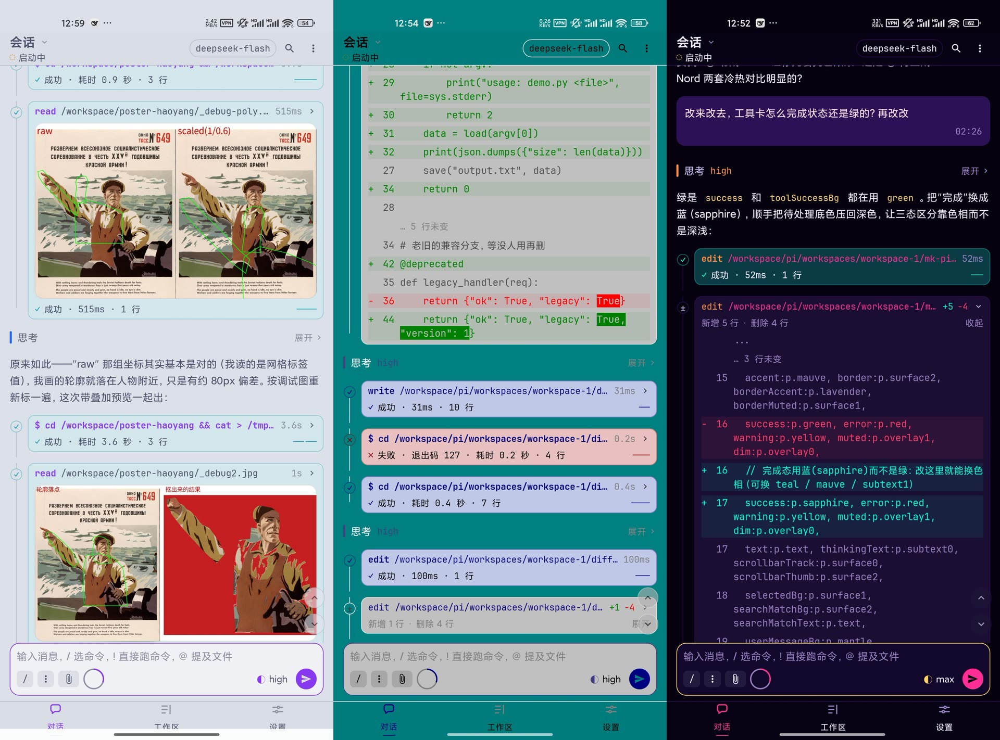
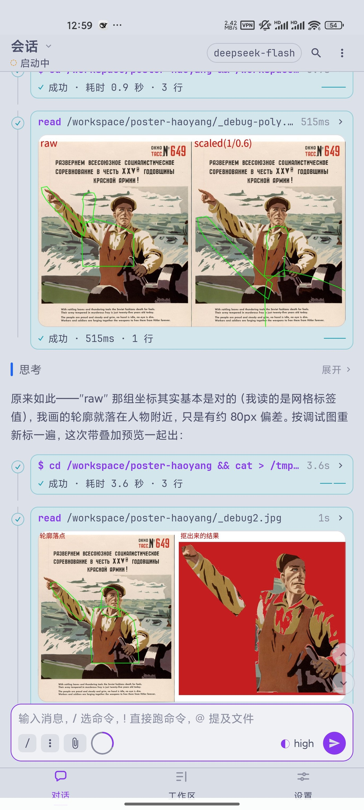
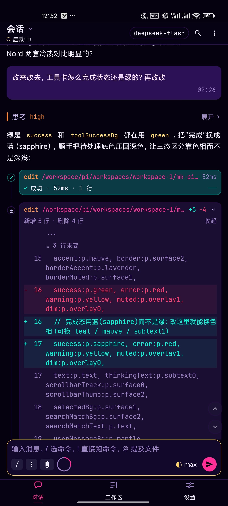
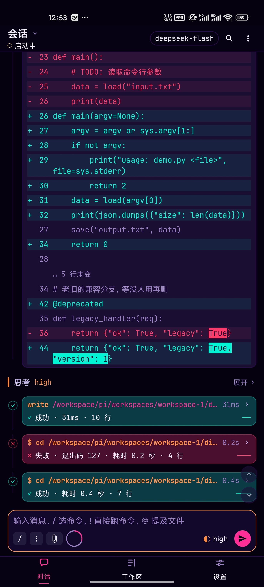
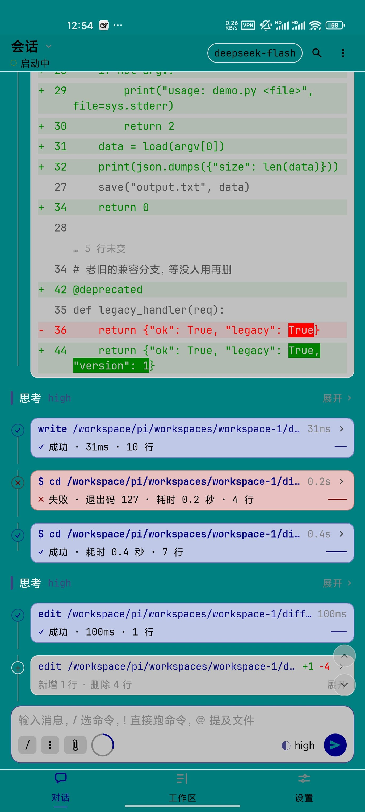
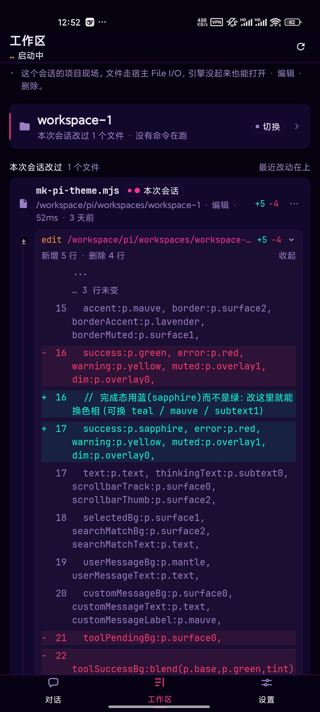
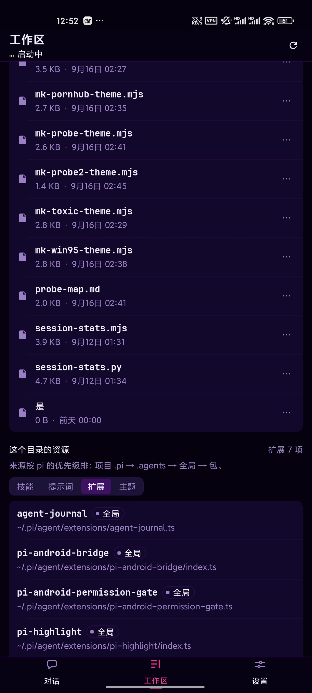

<p align="center">
  
</p>

<h1 align="center">PI</h1>

<p align="center">
  <strong>把 pi coding agent 完整装进安卓手机。</strong>
</p>

<p align="center">
  自带的 Ubuntu 与 Node 跑在本机 · 不需要 root · 能真的操作这台手机
</p>

<p align="center">
  <a href="#它是什么">它是什么</a> ·
  <a href="#装上">装上</a> ·
  <a href="#pi-升级">pi 升级</a> ·
  <a href="#手机上能做什么">手机上能做什么</a> ·
  <a href="#架构">架构</a> ·
  <a href="#它不做什么">它不做什么</a> ·
  <a href="#自己编译">自己编译</a>
</p>

<p align="center">
  <a href="./docs/screenshots/banner-three-themes.jpg"></a>
</p>

---

## 它是什么

一个安卓 App，把 [pi](https://github.com/earendil-works/pi) 跑在手机本地。

pi 是终端里的 coding agent。这个 App 给它补了三件手机上没有的东西：

1. **一个真实的 Linux 用户态**——Ubuntu base、官方 Node、git / ripgrep / fd / CA 证书，全部打进 APK，第一次打开就能开工，不需要先装 Termux 或别的 App。
2. **一块手机屏幕**——助手回复、工具调用、diff、图片、思考块都渲染成手机上该有的样子，全程不碰终端。
3. **一双手**——通过 pi 自己的扩展机制接上这台手机：读屏、点按、输入、文件、剪贴板、通知、传感器。每一项都要你单独授权，随时可以关。

会话、文件、命令、凭证都在本机。只有模型请求会发给你自己配置的服务。

---

## 装上

APK 目前只从 CI 产物发布（仓库还没有正式 release）：

1. 打开 [Actions](https://github.com/heikeyangle-code/pi-android/actions)，进最新一次成功的 `ci` 运行；
2. 下载 **`pi-android-sideload28`**（推荐）或 `pi-android-modern36`；
3. 解压得到 `app-release.apk`，装上。

| 变体 | targetSdk | 什么时候用 |
| :--- | :--- | :--- |
| `pi-android-sideload28` | 28 | **默认选这个。** 用 Android 10 以前那套沙箱规则，系统权限最少，行为最可预期 |
| `pi-android-modern36` | 36 | 面向新系统行为变更的版本，需要真机验证；只在 28 那个装不上或行为异常时才试 |

两个包用同一套密钥签名，**可以互相覆盖安装，升级不丢数据**。要求 Android 8.0 (API 26) 以上，arm64。

> [!NOTE]
> 首次启动会解包约 64 MiB 的运行时（APK 本身约 136 MB，大部分是这部分），比之后每次启动慢。之后只在载荷真的变化时才重新解包。

---

## pi 升级

上游 pi 平均不到五天发一个版本，这个仓库的应对方式是：**不改引擎，只换版本号。**

版本号只写在**一处**——`tools/fetch-runtime.mjs` 的 `PI_VERSION`。构建时按它取包、校验、打进载荷。上游加了新模型、新工具、新的会话行为，升版本号就有。

为了让这件事不悄悄出错，仓库里有三道检查：

- **`tools/pi-contract.mjs`**（CI 的独立 job）：把 App 依赖的每一件 pi 事实逐条对着**钉住的那个版本**核对——RPC 命令名、扩展界面方法、provider 预设、内置主题的每个色值、`models.json` 的替换与合并语义、工具结果文本、会话条目面、以及官方模型目录的格式。上游改名、删东西或改语义，**构建直接失败**，而不是发出去以后才发现。每条失败都会打印「该回去重读哪个 App 文件」。
- **diff 工具产物的字节**：判据是「字节相等」而不是「名字还在」——名字还在、语义变了，是这个仓库踩过两次的坑（`docs/known-gaps.md` §M11 / §M12）。
- **全部载荷按 SHA-256 锁定**：Linux 运行时、git 闭包、ripgrep/fd、proroot 的五个二进制记在 [`runtime.lock.json`](runtime.lock.json)；设备逐个载荷比对，只重解包真的变了的那个。

当前钉的是 **pi 0.99.2**。

---

## 手机上能做什么

**pi 发出的 33 条 RPC 命令全部接入，9 种扩展界面方法每一种都有落点。** 设备能力走一个独立扩展（30 个端点），默认全部关闭，按类授权：

<table>
<tr>
<td width="33%" valign="top"><strong>看得见</strong><br /><sub>读屏、截屏、列出已装应用、读当前界面结构</sub></td>
<td width="33%" valign="top"><strong>碰得到</strong><br /><sub>点按、输入、按键、滑动——操作的是这台手机的真实屏幕</sub></td>
<td width="33%" valign="top"><strong>喊得动</strong><br /><sub>通知、Toast、震动、分享、开链接</sub></td>
</tr>
<tr>
<td valign="top"><strong>拿得到</strong><br /><sub>剪贴板、位置、传感器、电池、手电</sub></td>
<td valign="top"><strong>够得着文件</strong><br /><sub>导出、导入、列目录、读、写（走系统目录授权）</sub></td>
<td valign="top"><strong>说得上话</strong><br /><sub>设备 shell：默认就是 App 自己的身份；要用更高身份，得你去设置里开</sub></td>
</tr>
</table>

### 工具结果画成卡片，不是一坨等宽文本

<table>
<tr>
<td width="50%" valign="top" align="center">
  <a href="./docs/screenshots/chat-light-tool-cards.jpg"></a><br />
  <sub><b>读进来的图，就画在卡里。</b><br />一张 <code>read</code> 卡并排摊开 <code>raw</code> 与 <code>scaled</code>。</sub>
</td>
<td width="50%" valign="top" align="center">
  <a href="./docs/screenshots/chat-dark-tool-cards.jpg"></a><br />
  <sub><b>思考可折叠，改动看得见。</b><br /><code>edit</code> 卡直接带 <code>+5/−4</code> 的 diff，改了哪几行一目了然。</sub>
</td>
</tr>
</table>

失败不会糊成一句「已完成」：

<table>
<tr>
<td width="50%" valign="top" align="center">
  <a href="./docs/screenshots/chat-theme-purple.jpg"></a>
</td>
<td width="50%" valign="top" align="center">
  <a href="./docs/screenshots/chat-theme-teal.jpg"></a>
</td>
</tr>
</table>

上面两张是**同一场对话、同一个滚动位置**，唯一不同的是主题文件：界面、代码高亮、diff、成功与失败的颜色一起换。中间那条红框写着 `失败 · 退出码 127 · 耗时 0.2 秒 · 4 行`，紧跟着同一条命令的成功重试——退出码、耗时、行数都摆出来。

### 工作区

<table>
<tr>
<td width="50%" valign="top" align="center">
  <a href="./docs/screenshots/workspace-session-changes.jpg"></a><br />
  <sub><b>这次会话动了哪儿。</b><br />会话碰过的文件与它们的 diff 收在一处。</sub>
</td>
<td width="50%" valign="top" align="center">
  <a href="./docs/screenshots/workspace-resources.jpg"></a><br />
  <sub><b>这个目录里有什么。</b><br />技能 / 提示词 / 扩展 / 主题，按 pi 的优先级发现出来，每一类都带真实路径。</sub>
</td>
</tr>
</table>

### 内置扩展（pi 0.99.0 起）

pi 现在自带四个扩展，这个 App 直接可用：

| 扩展 | 做什么 | 怎么用 |
| :--- | :--- | :--- |
| `mcp` | 连接 MCP 服务器（stdio 或 HTTP），把它们的工具交给模型 | 编辑 `mcp.json`（设置里的「Pi 文件」屏可以直接改），用 `/mcp` 看连接状态、登录、改 exposure |
| `codemode` | 让模型写 JavaScript，在沙箱里并行调用 pi 的工具 | 有 `codemode` exposure 的服务器连上时自动启用；或 `defaultTools` 里写 `["+codemode"]` |
| `tool-search` | 把「没直接声明给模型」的工具搜出来再声明，避免工具太多撑爆上下文 | 有 `deferred` 服务器时自动启用 |
| `llama.cpp` | 本地/局域网模型 | 设置里配 |

其中 `codemode` 的沙箱是纯 WASM（QuickJS），不带按架构编译的二进制，所以 arm64 上直接可用。

---

## 架构

**引擎。** pi 以官方 npm 包的形式随 APK 分发，App 用 pi 自己的 `--mode rpc` 驱动它（JSONL over stdio），不 fork、不打补丁、不在中间做转换层。会话内核、工具、扩展加载器、provider 工厂全部是上游那一份。

**协议。** 引擎之外是一个独立的纯 Kotlin/JVM 协议核心（[`rpc/`](rpc/) 模块，不带 Android 依赖）：33 条命令、9 种扩展界面方法、按 pi 的规则分帧（只按 `\n` 切、容忍 `U+2028`、增量 UTF-8 解码）。不插手机、不装模拟器就能跑完整套协议测试。

**运行时。** 工具执行的是这台手机上的真 Linux 用户态：

| | |
| :--- | :--- |
| **Ubuntu 24.04 base** | glibc 2.39——npm 的 `linux-arm64` 预编译件能直接跑 |
| **Node.js 24.19** | 官方 glibc 构建，`node` / `npm` 都是原生的 |
| **git · ripgrep · fd · CA 证书** | pi 的 `grep`、`find`、git 工具真正调用的那几个二进制 |
| **proot**（Termux 构建） | 用户态系统调用翻译层，所以**不需要 root** |

每个上游按 SHA-256 锁死，哈希一变构建直接失败。工作区可以是你手机上的任意目录。

**配置。** 写下去的都是 pi 自己的配置文件——`models.json`、`auth.json`、`settings.json`、`mcp.json`。App 不另存凭证，也不自己维护一套模型名单：pi 怎么读，这里就怎么读。13 条 provider 预设里，10 条的 `baseUrl` 与 `api` 逐条照抄 pi 的 provider 工厂（填错会注册成功、第一条消息才失败，正是导入页要挡掉的那类错）。

---

## 它不做什么

写在前面，省得你装完才发现：

- **不做离线推理。** 本地执行不等于本地模型——你要么连自己的服务，要么用局域网里的 Ollama / llama.cpp / vLLM。App 本身不含任何模型权重。
- **默认没有 root。** 设备 shell 默认是 App 自己的身份；要用更高身份，得你去「设置 → 设备能力授权」里开，而那需要设备本身已经 root 或装了 Shizuku。
- **不会自动读你的短信。** 短信是独立能力，需要在设置里单独开，且只读、只限当前 Android 用户。
- **不是一个"万能自动化脚本器"。** 读屏、点按这些能力是给 agent 用的接口，默认全关，按类授权，随时可撤。
- **`modern36` 变体还没在真机上验完。** 想稳就用 `sideload28`。
- **APK 大。** 约 136 MB，因为里面是一整个 Linux 用户态加 Node；这不是可以随手优化掉的东西。
- **没有 release、没有商店版本。** 目前只能从 CI 产物取或自己编译。

---

## 自己编译

```bash
./gradlew :rpc:test                    # 协议核心，不需要设备
./gradlew :app:assembleRelease         # targetSdk 28（侧载）
./gradlew :app:assembleRelease -Ppi.targetSdk=36
```

构建会拉取并校验钉住的上游载荷（[`tools/fetch-runtime.mjs`](tools/fetch-runtime.mjs)），产出 APK。

其他常用的：

```bash
node tools/pi-contract.mjs             # 对着钉住的引擎核对全部契约
node tools/fetch-runtime.mjs           # 只组装运行时载荷
bash tools/run-app-pure-checks.sh      # 纯逻辑 harness（不需要设备）
```

`docs/` 下有更细的东西：[pi 契约](docs/pi-contract.md)、[RPC 覆盖](docs/rpc-coverage.md)、[界面规格](docs/pi-android-ui-spec.md)。

---

## 致谢与许可

这个项目站在几个成熟上游之上，它们各自保留自己的许可与版权：

| 项目 | 它是什么 |
| :--- | :--- |
| **[pi](https://github.com/earendil-works/pi)** | 上游 coding agent，`@earendil-works/pi-coding-agent` **0.99.2**（MIT） |
| **[Ubuntu Base 24.04](https://cdimage.ubuntu.com/ubuntu-base/releases/24.04.3/release/)** | glibc 用户态 |
| **[Node.js 24.19](https://nodejs.org/en/download)** | 官方 glibc 构建 |
| **[proot](https://proot-me.github.io/)**（Termux 构建） | 用户态系统调用翻译层 |
| **[ripgrep](https://github.com/BurntSushi/ripgrep)** · **[fd](https://github.com/sharkdp/fd)** · git · CA 证书 | pi 的工具真正调用的那几个二进制 |

App 代码 MIT。包内的 pi 引擎同样是 MIT。第三方运行时与组件各自保留上游许可，原文随包分发：

- [pi 许可原文](app/src/main/assets/licenses/pi-license.txt)
- [第三方组件清单](app/src/main/assets/licenses/component-list.txt)
- [未随包提供许可文本的依赖](app/src/main/assets/licenses/pi-engine-licence-gaps.txt)
